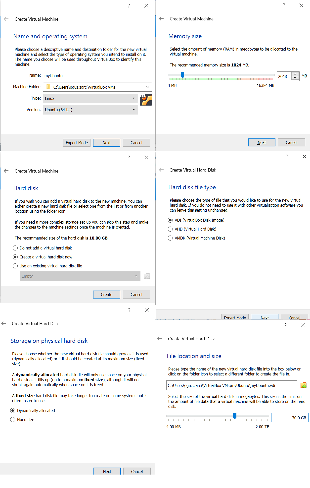
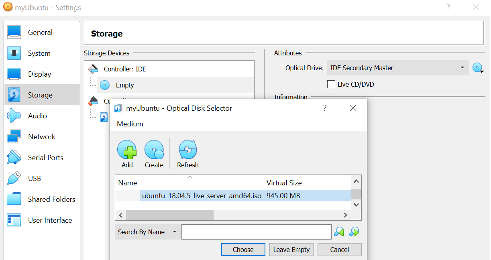

# Install Ubuntu Server Image
```
https://releases.ubuntu.com/18.04/ubuntu-18.04.5-live-server-amd64.iso
```
# Install Putty
```
https://the.earth.li/~sgtatham/putty/latest/w64/putty-64bit-0.74-installer.msi
```
# Create VirtualBox Ubuntu VM



# Install GitBash
```
https://git-scm.com/download/win
```

# Jenkins
```
sudo apt-get install openjdk-8-jdk
wget -q -O - https://pkg.jenkins.io/debian-stable/jenkins.io.key | sudo apt-key add -
sudo sh -c 'echo deb http://pkg.jenkins.io/debian-stable binary/ > /etc/apt/sources.list.d/jenkins.list'
sudo apt update
sudo apt upgrade
sudo apt install jenkins
sudo systemctl start jenkins
sudo ufw allow 8080
sudo ufw allow 22/tcp
```

```
sudo ufw status : Status: inactive ise
sudo ufw enable
sudo ufw default deny
sudo ufw allow 22/tcp
sudo ufw allow 8443/tcp
```
```
Jenkins user'ın docker grubuna eklenmesi
sudo usermod -aG docker jenkins
```

### Jenkins Plugins
* CloudBees Docker Build and Publish
* 

# Docker Install
```
sudo apt-get update
sudo apt-get upgrade

curl https://releases.rancher.com/install-docker/19.03.sh | sh
```

# Minikube

```
Powershell yönetici olarak çalıştırılır.
choco install minikube

minikube start --cpus 4 --driver=virtualbox

Minikube hata verirse.
bcdedit /set hypervisorlaunchtype off
```

## Others
* https://lingojam.com/TexttoOneLine